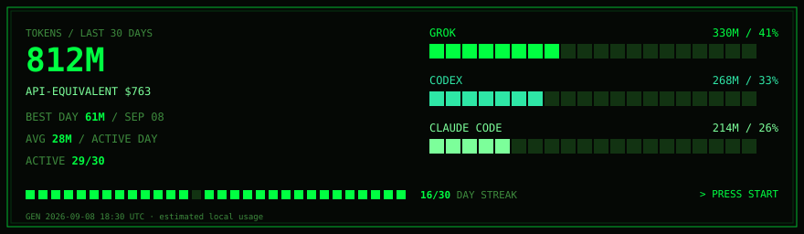
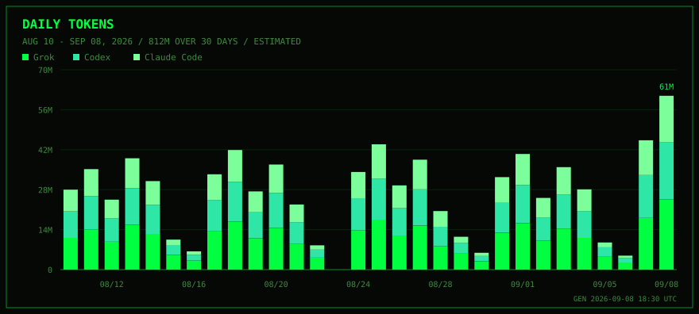
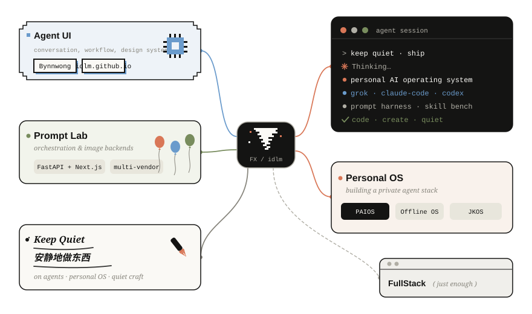

<p align="center">
  
</p>

<p align="center">
  <a href="https://git.io/typing-svg"></a>
</p>

<p align="center">
  
  
  
  
  
</p>

<p align="center">
  
  
  
  
  
  
  
</p>

```txt
idlm@github:~$ cat /etc/motd
> builder of personal agent systems
> daily operators: grok · codex · claude-code
> current exploit: PAIOS — a private personal AI operating system
> policy: 当你不再恐惧时，害怕就变成了兴奋剂。

idlm@github:~$ cat /var/log/tokens
```

<p align="center">
  
</p>

<p align="center">
  
</p>

```txt
idlm@github:~$ curl https://idlm.github.io
```

### `/map`



### `/proc/now`

```txt
PAIOS                         personal AI OS — runtime, memory, harness
offline-learning-os           fully offline learning environment
prompt-orchestration-engine   prompt lab + multi-vendor image backends
JKOS                          skill-development workbench
Bynnwong                      agent UI — conversation / workflow / system
cpa-codex-setup               one-shot Codex via CLIProxyAPI
```

### `/usr/local/bin`

| bin | target |
| :-- | :-- |
| [`idlm.github.io`](https://idlm.github.io) | homepage |
| [`Bynnwong`](https://github.com/idlm/Bynnwong) | agent UI designer |
| [`cpa-codex-setup`](https://github.com/idlm/cpa-codex-setup) | Codex bootstrap |
| [`Python-2-AI-Agent`](https://github.com/idlm/Python-2-AI-Agent) | agent experiments |

```txt
idlm@github:~$ ./keep_quiet --stealth
[*] stdout muted
[*] history wiped
[+] session sealed
```

<p align="center">
  
</p>
